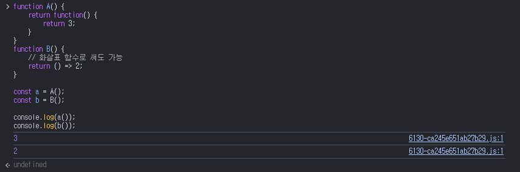
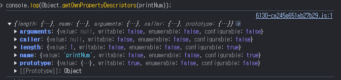
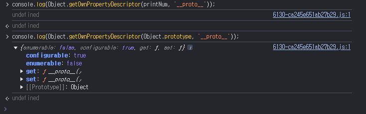
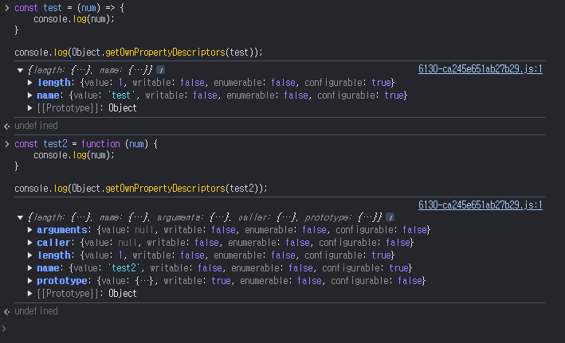

## 일급 객체의 조건

---

1. 무명의 리터럴로 생성할 수 있다. 즉, 런타임에 생성이 가능하다.
2. 변수나 자료구조에 저장할 수 있다.
3. 함수의 매개변수에 전달할 수 있다.
4. 함수의 반환값으로 사용할 수 있다.

```js
// 1. 무명의 리터럴로 생성할 수 있다. 즉, 런타임에 생성이 가능하다.
// 2. 변수나 자료구조에 저장할 수 있다.
const sum = function (num1, num2) {
  return num1 + num2;
};

// 2. 변수나 자료구조에 저장할 수 있다.
const testObj = { sum };
console.log(testObj.sum(1, 2)); // 3

// 3. 함수의 매개변수에 전달할 수 있다.
function sumOneAndTwo(sum) {
  return sum(1, 2);
}

// 4. 함수의 반환값으로 사용할 수 있다.
function returnSumFunc() {
  return function () {
    return 3;
  };

  // 화살표 함수로 써도 가능
  // return () => 2;
}
```



## 함수 객체의 프로퍼티

---

`printNum`함수의 프로퍼티 어트리뷰트들을 확인해보자.

```js
function printNum(num) {
  console.log(num);
}

console.log(Object.getOwnPropertyDescriptors(printNum));
```



여기서 복습! 프로퍼티 어트리뷰트에서 `writable`은 `value`의 변경여부, `configurable`은 프로퍼티 변경(삭제 및 수정) 여부를 다룬다! 자세한 내용 16장을 다시 보자.

`arguments, caller, length, name, prototype` 프로퍼티는 모두 함수 객체의 “데이터 프로퍼티”이다. 그리고 이들은 모두 함수 객체 고유의 프로퍼티이다.

(여기서 잠깐! 데이터 프로퍼티 말고 접근자 프로퍼티도 있었다. 간단히 복습을 해보자면 데이터 프로퍼티는 값을 저장하고 사용하는 일반적인 프로퍼티이고, 접근자 프로퍼티는 `get`, `set` 키워드를 사용하여 값을 읽거나 설정하는 동작을 추상화한다.)

하지만 ‘**proto**’는 접근자 프로퍼티이며, 함수 객체 고유의 프로퍼티가 아니라 `Object.prototype`객체의 프로퍼티를 상속받은 것이다.

함수 객체에는 ‘**proto**’ 프로퍼티가 없음을 알 수 있다.


`Object.prototype` 객체의 프로퍼티는 모든 객체가 상속받아 사용할 수 있다. 즉, `Object.prototype` 객체의 ‘**proto**’접근자 프로퍼티는 모든 객체가 사용할 수 있다! 상속에 대해서는 다음장인 19장 “프로토타입”에서 자세히 살펴보자.

## 생각해볼점

---



화살표 함수의 경우엔 위에서 설명한 것과 같은 프로퍼티 어트리뷰트가 출력되지 않는다.

### **1. `arguments` 및 `caller`의 차이**

- **화살표 함수**는 `arguments`와 `caller` 프로퍼티를 가지지 않습니다.
  - 화살표 함수는 자신만의 `arguments` 객체를 생성하지 않으며, 대신 상위 스코프의 `arguments`를 참조합니다.
  - `caller`도 마찬가지로 화살표 함수에서 생성되지 않습니다.
- **함수 선언문/표현식**은 `arguments`와 `caller` 프로퍼티를 기본적으로 가지고 있습니다.
  - 함수 선언문은 독립적으로 `arguments` 객체를 생성하여 전달된 인수들을 관리합니다.
  - `caller`는 호출 스택 정보를 제공하며, 함수의 호출자를 참조합니다.

### 이유:

화살표 함수는 설계상 간결함과 상위 컨텍스트를 따르는 특성을 가지기 때문에, `arguments`와 `caller`를 생성하지 않습니다. 반면, 전통적인 함수는 독립적인 실행 컨텍스트를 가지며, 이에 따라 해당 프로퍼티들이 포함됩니다.

---

### **2. `prototype` 프로퍼티의 차이**

- **화살표 함수**

  - `prototype` 프로퍼티를 가지지 않습니다.
  - 이는 화살표 함수가 생성자 함수로 사용할 수 없기 때문입니다. `new` 키워드로 호출하려고 하면 오류가 발생합니다.

- **함수 선언문/표현식**
  - `prototype` 프로퍼티를 가지고 있습니다.
  - 생성자 함수로 사용할 수 있도록 설계되었으며, `prototype`은 함수에 의해 생성된 객체의 원형(프로토타입)을 참조합니다.

### 이유:

화살표 함수는 설계상 생성자 역할을 수행하지 않도록 의도되었습니다. 생성자 함수로 사용될 필요가 없기 때문에 `prototype` 프로퍼티를 가지지 않습니다. 반면, 전통적인 함수는 생성자 함수로 사용될 수 있으므로 `prototype` 프로퍼티가 자동으로 정의됩니다.

---

### **3. `name`과 `length` 프로퍼티**

- 두 함수 모두 `name`과 `length` 프로퍼티를 가집니다.
  - `name`: 함수의 이름을 나타냅니다.
  - `length`: 함수의 인수 개수를 나타냅니다.
- 차이는 없습니다. 이는 함수가 호출 가능한 객체로서 일관된 동작을 제공하기 위해 설계된 공통 속성입니다.

화살표 함수는 26장에서 다룰 예정이기에 GPT의 도움을 받아보았다.(고마워요!)

## arguments 프로퍼티

---

함수 객체의 `arguments` 프로퍼티 값은 `arguments` 객체이다. `arguments` 객체는 함수 호출시 전달된 인수들의 정보를 담고 있는 순회 가능한 “유사 배열 객체”이며, 함수 내부에서 지역 변수처럼 사용된다. 즉, 함수 외부에서는 참조가 불가능하다.

함수 객체의 `arguments` 프로퍼티(는 ES3이후부터 폐지되었으므로, 사용할거면 `arguments` 객체를 참조하도록 하자.)

```js
console.log(Function.arguments); // error! by strict mode
```

자바스크립트는 함수의 매개변수와 인수의 개수가 일치하는지 확인하지 않는다. 따라서 함수 호출시 매개변수 개수 만큼의 인수를 전달하지 않아도 에러가 발생하지 않는다.

함수를 정의할 때 선언한 매개변수는 함수 몸체 내부에서 변수와 동일하게 취급된다. 즉, 함수가 호출되면 함수 몸체 내에서 암묵적으로 매개변수가 선언되고 `undefined`로 초기화된 이후 인수가 할당된다.(어..이거 `var`…냄새가..?)

선언된 매개변수의 개수보다 인수를 적게 전달했을 경우 인수가 전달되지 않은 매개변수는 `undefined`로 초기화된 상태를 유지한다. 매개변수 개수가 초과된 경우는 초과한 인수를 무시한다.

그렇다고 초과된 인수가 버려지는 것이 아닌 `arguments`객체에 저장된다.

`arguments`객체는 인수를 프로퍼티 값으로 소유하며 프로퍼티 키는 인수의 순서를 나타낸다. `arguments` 객체의 `callee`프로퍼티는 호출되어 `arguments` 객체를 생성한 함수, 즉 함수 자신을 가리키고 `arguments` 객체의 `length`프로퍼티는 인수의 개수를 가리킨다.

`arguments` 객체는 매개변수 개수를 확정할 수 없는 가변 인자 함수를 구현할 때 유용하다.

```js
function sum() {
  let total = 0;

  // arguments 객체를 사용하여 전달된 모든 인수를 합산
  for (let i = 0; i < arguments.length; i++) {
    total += arguments[i];
  }

  return total;
}

console.log(sum(1, 2, 3, 4)); // 10
console.log(sum(5, 10, 15)); // 30
console.log(sum()); // 0
```

`arguments` 객체는 유사 배열 객체이므로 실제론 배열이 아닌 “객체”이다.

따라서 `forEach, filter, map` 와 같은 배열 메서드들을 사용하면 에러가 발생한다. 배열 매서드를 사용하려면 `Function.prototype.call, Function.prototype.apply`를 사용해 간접 호출해야 한다. 이 이상은 다음장에서…

때문에 이러한 번거로움을 해결하기 위해 ES6에서는 `Rest 파라미터`를 도입했다(준필님이 예전에 말씀해주신 그것).

```js
function sum(...numbers) {
  return numbers.reduce((total, num) => total + num, 0);
}

console.log(sum(1, 2, 3, 4)); // 10
console.log(sum(5, 10, 15)); // 30
console.log(sum()); // 0

// 다음과 같이 객체 형태에도 유용하게 적용 가능하다.
function displayInfo({ name, age, ...other }) {
  console.log(`Name: ${name}, Age: ${age}`);
  console.log("Other info:", other);
}

displayInfo({ name: "Alice", age: 25, country: "USA", job: "Developer" });
// Name: Alice, Age: 25
// Other info: { country: 'USA', job: 'Developer' }
```

해당 `Rest 파라미터` 또한 26장에서 자세히 살펴볼 예정이다.

## caller 파라미터

---

`caller` 프로퍼티는 `ECMAScript` 사양에 포함되지 않은 비표준 프로퍼티다. 고로 가볍게 넘어가자.

`caller` 프로퍼티는 한마디로 자신을 호출한 함수를 가리킨다.

## length 프로퍼티

---

`length` 프로퍼티는 함수를 정의할 때 선언한 매개변수의 개수를 가리킨다.

이때 `length` 프로퍼티와 `argument` 객체의 `length` 프로퍼티는 다른 값을 가질 수 있으므로 주의바란다!

## name 프로퍼티

---

`name` 프로퍼티는 함수의 이름을 나타낸다. `name` 프로퍼티는 `ES5`와 `ES6`에서 동작을 달리한다. 익명 함수 표현식의 경우 `ES5`에서 `name` 프로퍼티는 빈 문자열을 값으로 갖는다. 하지만 `ES6`에서는 함수 객체를 가리키는 식별자를 값으로 갖는다.

```js
const namedFunc = function foo() {};
console.log(namedFunc.name);
// foo

const anonymousFunc = function () {};
console.log(anonymousFunc.name);
// ES5: 빈문자열
// ES6: anonymousFunc

function bar() {}
console.log(bar.name);
// bar
```

## ‘**proto**’ 접근자 프로퍼티

---

모든 객체는 `Prototye`이라는 내부 슬롯을 갖는다. `Prototype` 내부 슬롯은 객체지향 프로그래밍의 상속을 구현하는 프로토타입 객체를 가리킨다. 프로토타입 객체에 대해서는 다음장에서 자세히 살펴보자.

‘**proto**’ 프로퍼티는 `Prototype` 내부 슬롯이 가리키는 프로토타입 객체에 접근하기 위해 사용하는 접근자 프로퍼티다. 내부 슬롯에는 직접 접근할 수 없고 간접적인 접근 방법(접근자 프로퍼티)을 제공하는 경우에만 접근 가능하다.

## prototype 프로퍼티

---

`prototpye` 프로퍼티는 생성자 함수로 호출할 수 있는 함수 객체, 즉 `constructor`만이 소유하는 프로퍼티다. 일반 객체와 생성자 함수로 호출할 수 없는 `non-constructor`에는 `protorype` 프로퍼티가 없다.

`prototpye` 프로퍼티는 함수가 객체를 생성하는 생성자 함수로 호출될 때 생성자 함수가 생성할 인스턴스의 프로토타입의 객체를 가리킨다.

### prototype 프로퍼티가 없는 경우

```js
// 일반 객체는 prototype 프로퍼티가 없다
const obj = {};
console.log(obj.prototype);
// 출력: undefined (일반 객체는 prototype 프로퍼티를 가지지 않음)

// 화살표 함수도 prototype 프로퍼티가 없다
const ArrowFunc = () => {};
console.log(ArrowFunc.prototype);
// 출력: undefined (화살표 함수는 생성자 함수로 호출할 수 없기 때문에 prototype 없음)

// 화살표 함수는 생성자로 사용할 수 없다
try {
  new ArrowFunc();
} catch (e) {
  console.log(e.message);
  // 출력: ArrowFunc is not a constructor
}
```

### prototype 프로퍼티가 있는 경우

```js
// 생성자 함수는 prototype 프로퍼티를 가진다
function ConstructorFunc() {} // 생성자 함수
console.log(ConstructorFunc.prototype);
// 출력: {constructor: ƒ} (prototype 객체가 존재)

// 함수 표현식도 prototype 프로퍼티를 가진다
const NamedFunc = function () {};
console.log(NamedFunc.prototype);
// 출력: {constructor: ƒ} (prototype 객체가 존재)

// 생성자 함수로 객체를 생성할 수 있다
const instance = new NamedFunc();
console.log(instance);
// 출력: NamedFunc {}
```
