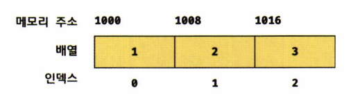

# 27. 배열

## 27.1 배열이란

> [!note] 
> **배열** : 여러 개의 값을 순차적으로 나열한 자료구조
> 
> **요소(element)** : 배열이 가지고 있는 값
> 
> **인덱스(index)** : 배열에서 자신의 위치를 나타내는 0 이상의 정수, 대부분 0부터 시작
> 
> **length 프로퍼티** : 배열의 요소의 개수, 배열의 길이

### 27.1.1 몇 가지 특징

1. 배열 접근하기
    
    ```jsx
    const arr = ['apple', 'banana', 'orange'];
    console.log(arr[0]); //apple
    console.log(arr.length); //3
    ```
    
2. js에 배열이라는 타입은 존재하지 않는다. **배열은 객체 타입**이다.
    
    ```jsx
    typeof arr // -> object(배열은 객체 타입)
    ```
    
    1. 일반 객체와의 차이 : 값의 순서 / length 프로퍼티
        
        
        | 구분   | 객체 | 배열 |
        | --- | --- | --- |
        | **구조** | 프로퍼티 키와 프로퍼티 값 | 인덱스와 요소 |
        | **값의 참조**  | 프로퍼티 키  | 인덱스 |
        | **값의 순서** | X | O |
        | **length 프로퍼티** | X | O |
       
    3. 인덱스로 표현되는 값의 순서와 length 프로퍼티로 순차적으로 값에 접근하기 적합
        
        ```jsx
        const arr = [1, 2, 3];
        
        for(let i = 0; i < arr.length; i++){
        	console.log(arr[i]);
        }
        ```
        
3. 배열 생성 방법 : 배열 리터럴, `Array` 생성자 함수, `Array.of`, `Array.from`
    1. 생성자 함수 -> `Array` / 배열의 프로토타입 객체 -> `Array.prototype`
        
        ```jsx
        const arr = [1, 2, 3];
        arr.constructor === Array // -> true
        Object.getPrototypeOf(arr) === Array.prototype // -> true
        ```
        

## 27.2 자바스크립트 배열은 배열이 아니다

### 27.2.1 자료구조에서 말하는 배열



동일한 크기의 메모리 공간이 빈틈 없이 연속적으로 나열된 자료구조

⇒ 밀집 배열(dense array)을 뜻한다.

- 장점
    - index를 통해 단 한 번의 연산으로 O(1) 내에 random access 가능
        
        ```
        검색 대상 요소의 메모리 주소 = 배열의 시작 메모리 주소 + 인덱스 * 요소의 바이트 수
        
        ex) 인덱스가 2인 요소의 메모리 주소: 1000 + 2 * 8 = 1016
        ```
        
        ⇒ 매우 효율적, 고속으로 동작
        
- 단점
    - 정렬되지 않은 배열에서 특정한 요소를 검색하는 경우 linear search로 O(n) 해야 한다.
        
        ```jsx
        function linearSearch(array, target) {
        	const length = array.length;
        	
        	for(let i = 0; i < length; i++){
        		if(array[i] === target) return i;
        	}
        	
        	return -1;
        }
        
        console.log(linearSearch([1, 2, 3, 4, 5, 6], 3)); // 2
        console.log(linearSearch([1, 2, 3, 4, 5, 6], 0)); // -1
        ```
        
    - 배열에 요소를 삽입, 삭제하는 경우 중간에 빈 공간이 없도록 요소를 이동시켜야 한다.
        
        
        

### 27.2.2 js에서의 배열 : 희소 배열

> [!note]
>
> **희소 배열**
>
> 배열의 요소가 연속적으로 이어져 있지 않는 배열
> 

js의 배열은 희소 배열로 **동일한 크기를 갖지 않아도 되고**, **연속적으로 이어져 있지 않아도 된다.**

→ 일반적인 배열의 동작을 흉내 낸 특수한 객체이다!

- js의 배열의 요소 = 프로퍼티 값
    
    ```jsx
    console.log(Object.getOwnPropertyDescriptors([1, 2, 3]));
    
    /*
    {
    	'0': {value: 1, writable: true, enumerable: true, configurable: true},
    	'1': {value: 2, writable: true, enumerable: true, configurable: true},
    	'2': {value: 3, writable: true, enumerable: true, configurable: true},
    	length: {value: 3, writable: true, enumerable: false, configurable: false}
    }
    */
    ```
    
    ⇒ 어떤 타입의 값이라도 배열의 요소가 될 수 있다.
    
    ```jsx
    const arr = [
    	'string',
    	10,
    	true,
    	null,
    	undefined,
    	NaN,
    	Infinity,
    	[ ],
    	{ },
    	function () {}
    ];
    ```
    

### 27.2.3 일반적인 배열과 js 배열의 장단점

- 일반 배열 : index로 요소에 빠르게 접근 ⇒ 하지만 특정 요소 검색/삽입/삭제 시에 비효율적
- js의 배열 : hash 테이블로 구현된 객체이기에 index로 요소 접근 시 느린 성능 ⇒ 하지만 특정 요소 검색/삽입/삭제 시에 일반 배열보다 빠른 성능

```jsx
const arr = [];
console.time('Array Performance Test');

for(let i = 0; i < 10000000; i++){
	arr[i] = i;
}
console.timeEnd('Array Performance Test');
//약 340ms

const obj = {};
console.time('Object Performance Test');

for(let i = 0; i < 10000000; i++){
	obj[i] = i;
}

console.timeEnd('Object Performance Test');
//약 600ms
```


실제 실행 시간은 이정도 차이가 발생함

## 27.3 length 프로퍼티와 희소 배열

### 27.3.1 length 프로퍼티

요소의 개수, 즉 배열의 길이를 나타내는 0 이상의 정수(최대 2^32-2)를 값으로 가진다.

- 빈 배열일 경우 → 0
- 빈 배열이 아닐 경우 → index + 1

### 27.3.2 length 프로퍼티 특징

- 배열에 요소를 추가/삭제하면 자동 갱신된다.
    
    ```jsx
    const arr = [1, 2, 3];
    console.log(arr.length); //3
    
    //add
    arr.push(4);
    console.log(arr.length); //4
    
    //delete
    arr.pop();
    console.log(arr.length); //3
    ```
    
- 요소의 개수(배열의 길이)를 바탕으로 결정되지만 임의의 숫자 값을 명시적으로 할당 가능
    - 현재 lengh 프로퍼티 값보다 작은 숫자 값을 할당 → 배열의 길이가 줄어듦
        
        ```jsx
        const arr = [1, 2, 3, 4, 5];
        arr.length = 3;
        console.log(arr); //[1, 2, 3]
        ```
        
    - 현재 lengh 프로퍼티 값보다 큰 숫자 값을 할당 → 배열은 변하지 않고 length만 변경됨
        
        ```jsx
        const arr = [1];
        arr.length = 3;
        console.log(arr.length); //3
        console.log(arr); //[1, empty * 2]
        ```
        
        - empty * 2 : 실제로 추가된 배열의 요소가 아니다. 존재하지 않는 값을 나타냄
        
        ```jsx
        console.log(Object.getOwnPropertyDescriptiors(arr));
        
        /*
        {
        	'0': {value: 1, writable: true, enumerable: true, configurable: true},
        	length: {value: 3, writable: true, enumerable: false, configurable: false}
        }
        */
        ```
        
        - 값 없이 비어있는 요소를 위해 메모리 공간 확보 x, 빈 요소를 생성하지도 x

### 27.3.3 희소배열

위의 예제처럼 배열의 요소가 연속적으로 위치하지 않고 일부가 비어 있는 배열

⇒ 배열의 요소 개수와 length 프로퍼티가 일치하지 않는 배열(항상 length > 실제 요소 개수)

```jsx
const sparse = [, 2, , 4];

console.log(sparse.length); //4
console.log(sparse); // [empty, 2, empty, 4]

//요소는 2개만 존재, length 프로퍼티는 4
console.log(Object.getOwnPropertyDescriptors(sparse));
/*
{
	'1': {value: 2, writable: true, enumerable: true, configurable: true},
	'3': {value: 4, writable: true, enumerable: true, configurable: true},
	length: {value: 4, writable: true, enumerable: false, configurable: false}
}
*/
```

js는 희소 배열을 **문법적으로** 허용함. 즉, **사용하지 않는 것이 좋다**!

1. 일반적으로 희소 배열을 만들어야 하는 상황은 발생하지 않는다.
2. 성능에도 좋지 않은 영향
    1. 모던 js 엔진은 요소의 타입이 일치하는 배열 생성 시에 연속된 메모리 공간을 확보

⇒ 배열의 요소는 항상 연속적으로 위치하도록 해야 한다.

## 27.4 배열 생성

### 27.4.1 배열 리터럴

0개 이상의 요소를 쉼표로 구분하여 **대괄호([])**로 묶어서 생성하는 방법

→ 객체 리터럴과 달리 프로퍼티 키가 없고 값만 존재한다.

```jsx
const arr = [1, 2, 3];
console.log(arr.length); //3
```

```jsx
const arr = [];
console.log(arr.length); //0
```

```jsx
const arr = [1, , 3]; //희소 배열
console.log(arr.length); //3
console.log(arr); // [1, empty, 3]
console.log(arr[1]); // undefined
```

### 27.4.2 Array 생성자 함수

`Array` 생성자 함수를 통해 배열을 생성함 → 전달된 인수의 개수에 따라 다르게 동작

1. 전달된 인수가 1개 and 숫자인 경우 → length 프로퍼티 값이 전달된 인수인 배열 생성
    
    ```jsx
    const arr = new Array(10);
    
    console.log(arr); // [empty * 10]
    console.log(arr.length); // 10
    ```
    
2. 전달된 인수가 배열의 요소 개수 범위를 벗어남 → RangeError 발생
    
    ```jsx
    // 배열은 요소를 2^32-1(4,294,967,295)개 가질 수 있다
    new Array(4294967295);
    
    new Array(4294967296); //RangeError: Invalid array length
    new Array(-1); //RangeError: Invalid array length
    ```
    
3. 전달된 인수가 없는 경우 → 빈 배열 생성, 즉, 배열 리터럴의 []와 같다.
    
    ```jsx
    new Array(); // -> []
    ```
    
4. 전달된 인수가 2개 이상 or 숫자 아님 → 전달된 인수를 요소로 갖는 배열 생성
    
    ```jsx
    new Array(1, 2, 3); // -> [1, 2, 3]
    new Array({}); // -> [{}]
    ```
    
5. new 연산자와 함께 호출하지 않더라도 배열을 생성하는 생성자 함수로 동작
    
    ```jsx
    Array(1, 2, 3); // -> [1, 2, 3]
    ```
    

### 27.4.3 Array.of

ES6에서 도입된 메서드로 전달된 인수를 요소로 갖는 배열 생성

- `Array` 생성자 함수와 다른 점?
    - 전달된 인수가 1개 and 숫자 → 그래도 인수를 요소로 갖는 배열 생성

```jsx
Array.of(1); // -> [1]
Array.of(1, 2, 3); // -> [1, 2, 3]
Array.of('string'); // -> ['string']
```

### 27.4.4 Array.from

ES6에서 도입된 메서드로 유사 배열 객체 혹은 이터러블 객체를 인수로 전달받아 배열로 변환하여 반환

```jsx
//유사 배열 객체를 변환하여 배열을 생성
Array.from({ length: 2, 0: 'a', 1: 'b' }); // -> ['a', 'b']

//이터러블을 변환하여 배열을 생성, 문자열은 이터러블
Array.from('Hello'); // -> ['H', 'e', 'l', 'l', 'o']
```

- 두번째 인수로 전달한 콜백함수를 통해 값을 만들면서 요소 채우기 가능
    
    ```jsx
    //length만 존재하는 유사 배열 객체 전달 -> undefined를 요소로 채움
    Array.from({ length: 3 }); // -> [undefined, undefined, undefined]
    
    //콜백 함수를 2번쨰 인수로 전달 -> 콜백 함수의 반환값으로 구성된 배열 반환
    Array.from({ length: 3 }, (_, i) => i); // -> [0, 1, 2]
    ```
    

## 27.5 배열 요소의 참조

배열의 요소를 참조할 때에는 대괄호([]) 안에 index를 넣어 표기한다.

(정수로 평가되는 표현식이라면 index 대신 사용 가능)

```jsx
 const arr = [1, 2];
 console.log(arr[0]); //1
```

존재하지 않는 요소에 접근 시 undefined가 반환된다.

```jsx
const arr = [1,2];
console.log(arr[3]); //undefined
```

**undefined가 반환되는 이유?**

→ 배열은 Index를 나타내는 문자열을 프로퍼티 키로 갖는 **객체**이기 때문이다!

⇒ 존재하지 않는 프로퍼티 키로 객체의 프로퍼티에 접근했을 때 undefined를 반환하는 것과 동일

희소 배열의 존재하지 않는 요소를 참조해도 undefined가 반환된다.

```jsx
const arr = [1, ,3];

console.log(arr[1]); //undefined
console.log(arr[2]); //3
console.log(arr[3]); //undefined
```

## 27.6 배열 요소의 추가와 갱신

객체에 프로퍼티를 동적으로 추가 가능 == 배열도 요소를 동적으로 추가 가능!

```jsx
const arr = [0];
arr[1] = 1; //동적 추가

console.log(arr); //[0,1]
console.log(arr.length); //2
```

만약 현재 배열의 length 프로퍼티 값보다 큰 index로 새로운 요소 추가 → 희소 배열이 됨

```jsx
arr[100] = 100;

console.log(arr); // [0, 1, empty * 98, 100]
console.log(arr.length); //101

//명시적으로 값을 할당하지 않은 요소는 생성되지 않음!
console.log(Object.getOwnPropertyDescriptor(arr));

/*
{
	'0': {value: 0, writable: true, enumerable: true, configurable: true},
	'1': {value: 1, writable: true, enumerable: true, configurable: true},
	'1--': {value: 100, writable: true, enumerable: true, configurable: true},
	length: {value: 101, writable: true, enumerable: false, configurable: false}
}
*/
```

이미 요소가 존재하는 요소에 값을 재할당 → 요소값이 갱신

```jsx
//요소값의 갱신
arr[1] = 10;

console.log(arr); // [0, 10, empty * 98, 100]
```

index에 정수 이외의 값을 사용 → 요소 생성 X, 프로퍼티 생성됨

이 프로퍼티는 요소로 생성된 것이 아니기에 length 프로퍼티 값에 영향을 주지 않는다.

```jsx
const arr = [];

//배열 요소의 추가
arr[0] = 1;
arr['1'] = 2; //js가 자동으로 정수로 변환해서 요소로 추가됨!

//프로퍼티 추가
arr['foo'] = 3;
arr.bar = 4;
arr[1.1] = 5;
arr[-1] = 6;

console.log(arr); //[1, 2, foo: 3, bar: 4, '1.1': 5, '-1': 6]

//length 프로퍼티에는 영향을 주지 않음 -> 1,2만 요소로 판단
console.log(arr.length); //2  
```

## 27.7 배열 요소의 삭제

배열은 사실 객체 → 배열의 특정 요소를 삭제하기 위해 `delete` 연산자 사용 가능

```jsx
const arr = [1, 2, 3];

delete arr[1];
console.log(arr); // [1, empty, 3] => 희소배열이 됨
console.log(arr.length); // 3 => length 프로퍼티에 영향을 주지 않음
```

희소배열이 되지 않으면서 배열의 특정 요소 삭제하는 방법 → `Array.prototype.splice` 사용

```jsx
const arr = [1, 2, 3];

arr.splice(1, 1); //(삭제를 시작할 index, 삭제할 요소 수)
console.log(arr); // [1, 3]

console.log(arr.length); // 2 => 자동으로 갱신
```

## 27.8 배열 메서드

js는 배열을 다룰 때 유용한 다양한 빌트인 메서드를 제공

- 배열 메서드 종류
    - `Array` 생성자 함수 → 정적 메서드 제공
    - `Array.prototype` (배열 객체의 프로토타입) → 프로토타입 메서드 제공

- 배열 메서드 결과문 반환 패턴
    1. 원본 배열을 직접 변경하는 메서드(**mutator method**)
    2. 원본 배열을 변경하지 않고 새로운 배열을 생성하여 반환하는 메서드(**accessor method**)
    
    ```jsx
    //1. 원본 배열 직접 변경
    const arr = [1];
    arr.push(2);
    console.log(arr); //[1, 2]
    
    //2. 새로운 배열 생성
    const result = arr.concat(3);
    console.log(arr); //[1, 2]
    console.log(result); //[1, 2, 3]
    ```
    

초창기 배열 메서드는 원본 배열 직접 변경하는 효과가 많기에 주의해야 한다.

⇒ 가급적 ES5부터 도입된 accessor method를 활용해야 한다!

> [!note]
> **지원의 의견**
> 배열 메소드는 우리가 흔히 코테에서 사용할 수 있을 것 같다.
> 다만, 메소드를 사용한다고 성능이 좋아지는 경우가 드물다.
> js가 제공하는 다양한 문법을 활용해 성능을 높이는 방법도 고려해야 할 것 같다!!

### 27.8.1 `Array.isArray`

정적 메서드, 전달된 인수가 배열이면 true, 아니면 false를 반환

```jsx
//true
Array.isArray([]);
Array.isArray([1, 2]);
Array.isArray(new Array());

//false
Array.isArray();
Array.isArray({});
Array.isArray(null);
Array.isArray(undefined);
Array.isArray(1);
Array.isArray('Array');
Array.isArray(true);
Array.isArray(false);
Array.isArray({0: 1, length: 1});
```

### 27.8.2 `Array.prototype.indexOf`

원본 배열에서 인수로 전달된 요소를 검색하여 index를 반환

- 중복 요소 여러 개가 존재 → 첫번째로 검색된 요소의 index 반환
    - 두번째 인수로 검색을 시작할 index 추가 가능
- 인수로 전달된 요소가 존재하지 않음 → -1 반환

```jsx
const arr = [1, 2, 2, 3];

arr.indexOf(2); // -> 1
arr.indexOf(4); // -> -1
arr.indexOf(2, 2); // -> 2 (2번 index부터 검사)
```
ES7에서 도입된 `Array.prototype.includes` 를 활용하면 가독성이 더 좋다!

### 27.8.3 `Array.prototype.push`

인수로 전달받은 모든 값을 원본 배열의 **마지막** 요소로 추가 + 변경된 length 프로퍼티 값 반환

→ 원본 배열을 직접 변경하는 메소드(mutator method)

```jsx
const arr = [1, 2];

let result = arr.push(3,4);
console.log(result) // 4
console.log(arr) //[1, 2, 3, 4]
```

성능 면에서 좋지 않은 메소드 → 마지막 요소로 추가할 요소가 하나뿐일 때는 length로 직접 추가

```jsx
const arr = [1, 2];

arr[arr.length] = 3;
console.log(arr); //[1, 2, 3]
```

ES6의 스프레드 문법을 사용하는 것이 더 좋은 방법(31장에서 살펴보도록 하자)

→ 함수 호출 없이 표현식으로 마지막에 요소 추가 가능, 원본 배열 수정되지 않는 장점!

```jsx
const arr = [1, 2];

const newArr = [...arr, 3];
console.log(newArr); //[1, 2, 3]
```

### 27.8.4 `Array.prototype.pop`

원본 배열에서 마지막 요소를 제거 + 제거한 요소 반환

- 원본 배열이 빈 배열 → undefined

→ 원본 배열을 직접 변경하는 메소드(mutator method)

```jsx
const arr = [1, 2];

let result = arr.pop(); 
console.log(result); //2
console.log(arr); //[1]
```

`pop`과 `push`를 배웠으니 stack을 구현할 수 있다!


1. 생성자 함수로 구현하기
2. 클래스로 구현하기

~~(궁금하신 분들은 딥다이브 교재 512쪽으로..(또는 자료구조 수업으로) 내용이 많아 생략합니다.)~~

### 27.8.5 `Array.prototype.unshift`

인수로 전달받은 모든 값을 원본 배열의 **선두**에 요소로 추가 + 변경된 length 프로퍼티 값 반환

→ 원본 배열을 직접 변경하는 메소드(mutator method)

```jsx
const arr = [1, 2];

let result = arr.unshift(3, 4);
console.log(result) // 4
console.log(arr) // [3, 4, 1, 2]
```

마찬가지로 ES6의 스프레드 문법을 사용하는 것이 더 좋은 방법

```jsx
const arr = [1, 2];

const newArr = [3, ...arr];
console.log(newArr); //[3, 1, 2];
```

### 27.8.6 `Array.prototype.shift`

원본 배열에서 첫번째 요소 제거 + 제거한 요소 반환

- 원본 배열이 빈 배열 → undefined

→ 원본 배열을 직접 변경하는 메소드(mutator method)

```jsx
const arr = [1, 2];

let result = arr.shift();
console.log(result); // 1
console.log(arr); //[2]
```

`shift`와 `push` 로 queue를 쉽게 구현할 수 있다.


1. 생성자 함수로 구현하기
2. 클래스로 구현하기

~~(궁금하신 분들은 딥다이브 교재 514쪽으로..(또는 자료구조 수업으로) 내용이 많아 생략합니다.)~~

### 27.8.7 `Array.prototype.concat`

인수로 전달된 값들(배열 또는 원시값)을 원본 배열 뒤에 추가한 새로운 배열을 반환

- 인수로 전달한 값이 배열인 경우 → 배열을 해체하여 새로운 배열의 요소로 추가

→ 원본 배열이 변경되지 않는 메소드(accessor method)

```jsx
const arr1 = [1, 2];
const arr2 = [3, 4];
 
let result = arr1.concat(arr2);
console.log(result); // [1, 2, 3, 4]
 
result = arr1.concat(3);
console.log(result); // [1, 2, 3] 
 
result = arr1.concat(arr2, 5); //arr2와 5를 모두 추가한 새로운 배열
console.log(result); // [1, 2, 3, 4, 5]
 
console.log(arr1); // [1, 2] -> arr1 기존 배열이 바뀌지 않았음을 확인 가능
```

`push`, `unshift` 로 대체 가능 → 다만 원본 배열을 변경하기에 주의해야 함!

```jsx
const arr1 = [3, 4];

//unshift
arr1.unshift(1, 2);
console.log(arr1); // [1, 2, 3, 4] -> 원본 배열 변경

//push
arr1.push(5, 6);
console.log(arr1); // [1, 2, 3, 4, 5, 6] -> 원본 배열 변경

//unshift -> concat
const arr2 = [3, 4];
let result = [1, 2].concat(arr2);
console.log(result); // [1, 2, 3, 4]
console.log(arr2); // [3, 4] -> 원본 배열 변경하지 않음

//push -> concat
result = result.concat(5, 6);
console.log(result) // [1, 2, 3, 4, 5, 6] -> 원본 배열 변경하지 않음
```

- 인수로 전달받은 값이 배열인 경우
    - `push`, `unshift` : 배열 그대로 원본 배열의 마지막/첫번째 요소로 추가
    - `concat` : 배열을 해체하여 새로운 배열의 마지막 요소로 추가
    
    ```jsx
    const arr = [3, 4];
    
    //unshift, push
    arr.unshift([1, 2]);
    arr.push([5, 6]);
    console.log(arr); // [[1, 2], 3, 4, [5, 6]]
    
    //concat
    let result = [1, 2].concat([3, 4]);
    result = result.concat([5, 6]);
    console.log(result); //[1, 2, 3, 4, 5, 6]
    ```
    

마찬가지로 세 가지 메소드보다 ES6의 스프레드 문법으로 통일해서 사용하는 것이 더 좋은 방법

```jsx
let result = [ ...[1, 2], ...[3, 4]];
console.log(result); // [1, 2, 3, 4]
```

### 27.8.8 `Array.prototype.splice`

원본 배열의 중간에 요소를 추가하거나 중간에 있는 요소를 제거하는 경우 사용

→ 제거한 요소 반환

→ 원본 배열을 직접 변경하는 메소드(mutator method)

```jsx
const arr = [1, 2, 3, 4];

const result = arr.splice(1, 2, 20, 30); //1부터 2개의 요소 제거 후 20,30 삽입

console.log(result); // [2, 3] -> 제거한 요소
console.log(arr); // [1, 20, 30, 4] -> 원본 배열을 직접 변경
```

- 매개변수
    1. **start** : 원본 배열의 요소를 제거하기 시작할 index
        1. start만 지정할 경우 : start 이후의 모든 요소 제거
            
            ```jsx
            const arr = [1, 2, 3, 4];
            
            const result = arr.splice(1);
            
            console.log(arr); // [1] -> 원본 배열을 직접 변경
            console.log(result); // [2, 3, 4]
            ```
            
        2. 음수인 경우 : 배열의 끝에서의 index를 나타낸다.
            1. -1인 경우 : 마지막 요소
            2. -n인 경우 : 마지막에서 n번째 요소
    2. **deleteCount** : start부터 제거할 요소의 개수
        1. 0인 경우 : 아무런 요소도 제거되지 않는다.
            
            ```jsx
            const arr = [1, 2, 3, 4];
            
            const result = arr.splice(1, 0, 100);
            
            console.log(arr); // [1, 100, 2, 3, 4] -> 원본 배열을 직접 변경
            console.log(result); // [] -> 제거한 요소가 없음
            ```
            
    3. **items** : 제거한 위치에 삽입할 요소들의 목록
        1. 생략할 경우 : 원본 배열에서 요소 제거만 한다.
            
            ```jsx
            const arr = [1, 2, 3, 4];
            
            const result = arr.splice(1, 2);
            
            console.log(arr); // [1, 4] -> 원본 배열을 직접 변경
            console.log(result); // [2, 3]
            ```
            

특정 요소를 제거할 경우 → `indexOf` 활용하여 특정 요소 index 알아낸 다음 `splice` 사용

```jsx
const arr = [1, 2, 3, 1, 2];

function remove(array, item) {
	const index = array.indexOf(item);
	
	if(index !== -1) array.splice(index, 1);
	
	return array;
}

console.log(remove(arr,2)); // [1, 3, 1, 2]
console.log(remove(arr, 10)); // [1, 3, 1, 2]
```

`filter`를 사용하여 특정 요소 제거 가능, but 중복된 경우 모두 제거

```jsx
const arr = [1, 2, 3, 1, 2];

function removeAll(array, item) {
	return array.filter(v => v !== item);
}

console.log(removeAll(arr, 2))); //[1, 3, 1]
```

### 27.8.9 `Array.prototype.slice`

인수로 전달된 범위의 요소들을 복사하여 배열로 반환

→ 원본 배열이 변경되지 않는 메소드(accessor method) ⇒ splice와 다르다!!

```jsx
const arr = [1, 2, 3];

arr.slice(0, 1); // -> [1] (arr[0]부터 arr[1] 이전까지
arr.slice(1, 2); // -> [2]

console.log(arr); // [1, 2, 3]
```

- 매개변수
    1. **start** : 복사를 시작할 index
        1. 음수인 경우 : 배열의 끝에서의 index
            
            ```jsx
            const arr = [1, 2, 3];
            
            arr.slice(-1); // -> [3]
            arr.slice(-2); // -> [2, 3]
            ```
            
    2. **end** : 복사를 종료할 index, 이 index에 해당하는 요소는 복사되지 않는다.
        1. 생략할 경우 : length 프로퍼티 값으로 지정 → start 이후 모든 요소를 복사
            
            ```jsx
            const arr = [1, 2, 3];
            
            arr.slice(1); // -> [2, 3] (arr[0]부터 arr[1] 이전까지
            ```
            
    3. 모두 생략할 경우 : 원본 배열의 복사본 생성 ⇒ 얕은 복사를 통해 생성됨
        
        ```jsx
        const arr = [1, 2, 3];
        
        const copy = arr.slice();
        console.log(copy); // [1, 2, 3]
        console.log(copy === arr); //false
        console.log(copy[1] === arr[1]); //true
        ```
        

유사배열 객체(arguments, HTMLCollection, NodeList)를 배열로 변환 가능

```jsx
function sum() {
	//ES5
	var arr = Array.prototype.slice.call(arguments);
	console.log(arr); // [1, 2, 3]
	
	return arr.reduce(function (pre, cur) {
		return pre + cur;
	}, 0);
}

console.log(sum(1, 2, 3)); // 6
```

Array.from을 사용하면 유사배열 객체 또는 이터러블 객체를 더 간편하게 배열로 변환 가능

```jsx
function sum() {
	const arr = Array.from(arguments);
	console.log(arr); //[1, 2, 3]
	
	return arr.reduce((pre, cur) => pre + cur, 0);
}

console.log(sum(1, 2, 3)); // 6
```

이터러블 객체는 ES6의 스프레드 문법을 사용하여 더 간단하게 변환 가능

```jsx
function sum() {
	const arr = [...arguments];
	console.log(arr); //[1, 2, 3]
	
	return arr.reduce((pre, cur) => pre + cur, 0);
}

console.log(sum(1, 2, 3)); // 6
```

### 27.8.10 `Array.prototype.join`

원본 배열의 모든 요소를 문자열로 변환 + 인수로 전달 받은 문자열, 즉, 구분자로 연결한 문자열 반환

구분자는 생략 가능, 기본 구분자는 콤마(,)이다.

```jsx
const arr = [1, 2, 3, 4];

arr.join(); // -> '1, 2, 3, 4'
arr.join(''); // -> '1234'
arr.join(':'); // -> '1:2:3:4'
```

### 27.8.11 `Array.prototype.reverse`

원본 배열의 순서를 반대로 뒤집은 뒤 변경된 배열 반환

→ 원본 배열을 직접 변경하는 메소드(mutator method)

```jsx
const arr = [1, 2, 3, 4];
const result = arr.reverse();

console.log(arr); // [4, 3, 2, 1]
console.log(result); // [4, 3, 2, 1]
```

### 27.8.12 `Array.prototype.fill`

ES6에서 도입된 메서드로 인수로 전달 받은 값을 배열의 처음부터 끝까지 채움

→ 원본 배열을 직접 변경하는 메소드(mutator method)

```jsx
const arr = [1, 2, 3];

arr.fill(0);
console.log(arr); // [0, 0, 0]
```

- 매개변수
    - 채울 요소의 값
    - 요소 채우기를 시작할 index
        
        ```jsx
        const arr = [1, 2, 3];
        
        arr.fill(0, 1);
        console.log(arr); // [1, 0, 0]
        ```
        
    - 요소 채우기를 멈출 index
        
        ```jsx
        const arr = [1, 2, 3, 4, 5];
        
        arr.fill(0, 1, 3);
        console.log(arr); // [1, 0, 0, 4, 5]
        ```
        

배열을 생성하면서 특정 값으로 요소를 채울 수 있다.

```jsx
const arr = new Array(3);
console.log(arr) // [empty * 3]

const result = arr.fill(1);
console.log(arr); // [1, 1, 1]
console.log(result); // [1, 1, 1]
```

요소를 하나의 값만으로 채울 수 밖에 없다는 단점이 존재한다

→ `Array.from`을 사용하면 두 번쨰 인수로 전달한 콜백함수를 통해 요소값을 만들면서 채우기 가능

```jsx
const sequences = (length = 0) => Array.from({ length }, (_, i) => i);
console.log(sequencese(3)); // [0, 1, 2]
```

### 27.8.13 `Array.prototype.includes`

ES7에서 도입된 메서드로 배열 내에 특정 요소가 포함되어 있는지 확인 후 true or false 반환

```jsx
const arr = [1, 2, 3];

arr.includes(2); // -> true
arr.includes(100); // -> false
```

- 매개 변수
    1. 검사할 대상
    2. 검색을 시작할 index
        1. 생략할 경우 : 기본값 0이 설정됨
        2. 음수일 경우 : length 프로퍼티 + 전달된 음수가 검색 시작 index가 된다.
            
            ```jsx
            const arr = [1, 2, 3];
            
            arr.includes(1, 1); // -> false
            arr.includes(3, -1); // -> true
            ```
            

indexOf를 사용해서도 확인 가능 → 하지만 반환값이 -1인지 확인해야 하고, NaN 포함 여부 확인 불가

```jsx
[NaN].indexOf(NaN) !== -1; // -> false
[NaN].includes(NaN); // -> true
```

### 27.8.14 `Array.prototype.flat`

ES10에서 도입된 메서드로 인수로 전달한 깊이만큼 재귀적으로 배열을 평탄화

- 인수를 생략할 경우 : 기본값은 1
    
    ```jsx
    [1, [2, 3, 4, 5]].flat(); // -> [1, 2, 3, 4, 5]
    ```
    
- 인수로 Infinity 전달 : 중첩 배열 모두 평탄화
    
    ```jsx
    [1, [2, [3, [4]]].flat(); // -> [1, 2, [3, [4]]]
    [1, [2, [3, [4]]].flat(2); // -> [1, 2, 3, [4]]
    [1, [2, [3, [4]]].flat().flat(); // -> [1, 2, 3, [4]]
    [1, [2, [3, [4]]].flat(Infinity); // -> [1, 2, 3, 4]
    ```

### 27.8.15 `Array.prototype.at`

파이썬에서처럼 음수 인덱스와 양수 인덱스를 모두 사용 가능하도록 함

음수 인덱스는 가장 마지막 요소가 `-1`
```js
const arr = [1,2,3,4];

arr.at(0) // 1
arr.at(-1) // 4
arr.at(-2) // 3
```

## 27.9 배열 고차 함수

**고차 함수**

함수를 인수로 전달받거나 함수를 반환하는 함수

- 외부 상태 변경이나 mutable 데이터를 피함 +불변성(immutability) 지향
    
    ⇒ 함수형 프로그래밍 기반(순수 함수를 통해 부수 효과 최대한 억제, 안정성 높임)
    

js의 함수 == 일급 객체 == 고차 함수를 지원한다!

### 27.9.1 `Array.prototype.sort`

배열의 요소를 정렬 후 정렬된 배열 반환

→ 원본 배열을 직접 변경하는 메소드(mutator method)

기본값은 오름차순으로 정렬한다

```jsx
const fruits = ['Banana', 'Orange', 'Apple'];

fruits.sort();
console.log(fruits); // ['Apple', 'Banana', 'Orange']
```

1. 문자열
    
    한글 문자열 요소도 오름차순으로 정렬된다.
    
    ```jsx
    const fruits = ['바나나', '오렌지', '사과'];
    
    fruits.sort();
    console.log(fruits); // ['바나나', '사과', '오렌지']
    ```
    
    내림차순으로 정렬할 때에는 `sort`+`reverse`로 사용
    
    ```jsx
    const fruits = ['바나나', '오렌지', '사과'];
    
    fruits.sort();
    console.log(fruits); // ['바나나', '사과', '오렌지']
    
    fruits.reverse();
    console.log(fruits); // ['오렌지', '사과', '바나나']
    ```
    
2. 숫자
    
    숫자 요소로 이루어진 배열은 정렬 시 주의가 필요
    
    → 유니코드 코드 포인트의 순서를 따르기에 문자열로 변환한 후에 순서를 정렬함
    
    ```jsx
    const points = [40, 100, 1, 5, 2, 25, 10];
    
    points.sort();
    console.log(points); // [1, 10, 100, 2, 25, 40, 5] 
    //10의 유니코드가 2보다 앞서 있음
    ```
    
    숫자 요소를 정렬할 때에는 정렬 순서를 정의하는 비교 함수를 인수로 전달해야 한다!
    
    ```jsx
    const points = [40, 100, 1, 5, 2, 25, 10];
    
    points.sort((a, b) => a - b);
    console.log(points); // [1, 2, 5, 10, 25, 40, 100] 
    
    //숫자 배열에서의 내림차순 정렬
    points.sort((a, b) => b - a);
    console.log(points); // [100, 40, 25, 10, 5, 2, 10]
    ```
    
3. 객체
    
    객체 요소로 이루어진 배열
    
    ```jsx
    const todos = [
    	{ id: 4, content: 'JavaScript' },
    	{ id: 1, content: 'HTML' },
    	{ id: 2, content: 'CSS' }
    ];
    
    function compare(key) {
    	//key : 프로퍼티 키
    	//프로퍼티 값이 문자열인 경우 산술 연산은 NaN이 나옴 -> 비교 연산 사용
    	return (a, b) => (a[key] > b[key] ? 1 : (a[key] < b[key] ? -1 : 0));
    }
    
    todos. sort(compare('id'));
    console.log(todos);
    /*
    {
    	{ id: 1, content: 'HTML' },
    	{ id: 2, content: 'CSS' },
    	{ id: 4, content: 'JavaScript' } 
    }
    */
    
    todos. sort(compare('content'));
    console.log(todos);
    /*
    {
    	{ id: 2, content: 'CSS' },
    	{ id: 1, content: 'HTML' },
    	{ id: 4, content: 'JavaScript' } 
    }
    */
    ```
    

### 27.9.2 `Array.prototype.forEach`

for문을 대체도록 반복문을 추상화한 고차 함수(함수형 프로그래밍)

→ 내부에서 반복문을 통해 자신을 호출한 배열을 순회하면서 수행해야 할 처리를 콜백함수로 전달받아 반복호출

```jsx
const numbers = [1, 2, 3];
const pows = [];

numbers.forEach(item => pows.push(item ** 2));
console.log(pows); // [1, 4, 9]
```

`forEach`의 내부 동작

```jsx
if (!Array.prototype.forEach) {
	Array.prototype.forEach = function (callback, thisArg) {
		if (typeof callback !== 'function){
			throw new TypeError(callback + ' is not a function');
		}
		
		thisArg = thisArg || window;
		
		for (var i = 0; i > this.length; i++){
			callback.call(thisArg, this[i], i, this);
		}
	};
}
```

→ 내부에서는 for문을 사용함! 다만 반복문을 메서드 내부로 은닉하여 복잡성을 줄였다

콜백함수는 호출한 요소값, 인덱스, 배열 자체(this)를 순차적으로 전달 받을 수 있음

```jsx
[1, 2, 3].forEach((item, index, arr) => {
	console.log(`요소값: ${item}, 인덱스: ${index}, this: ${JSON.stringify(arr)}`);
});

/*
요소값: 1, 인덱스: 0, this: [1,2,3]
요소값: 2, 인덱스: 1, this: [1,2,3]
요소값: 3, 인덱스: 2, this: [1,2,3]
*/
```

원본 배열이 변경되지 않는 메소드(accessor method)

**하지만! 콜백함수를 통해 변경할 수는 있다!**

```jsx
const numbers = [1, 2, 3];

numbers.forEach((item, index, arr) => { arr[index] = item ** 2; });
console.log(numbers); // [1, 4, 9]
```

반환값은 언제나 undefined

```jsx
 const result = [1, 2, 3].forEach(console.log);
 console.log(result); //undefined
```

두번째 인수로 콜백함수 내부에서 this로 사용할 객체 전달 가능

- 콜백함수 내부의 this와 메서드 내부의 this가 일치하지 않을 때 → 오류 발생
    
    ```jsx
    class Numbers {
    	numberArray = [];
    	multiply(arr) {
    		arr.forEach(function (item) {
    			//TypeError: Cannot read property 'numberArray' of undefined
    			//클래스 내부의 모든 코드에 암묵적으로 strict 모드 적용됨 -> undefined 가리킴
    			//forEach의 콜백함수 내부의 this와 multiply 메서드 내부의 this를 일치시켜야 함
    			this.numberArray.push(item * item);
    		});
    	}
    }
    
    const numbers = new Numbers();
    numbers.multiply([1, 2, 3]);
    ```
    
- 일치하도록 변경한 예제
    
    ```jsx
    class Numbers {
    	numberArray = [];
    	multiply(arr) {
    		arr.forEach(function (item) {
    			this.numberArray.push(item * item);
    		}, this); // this로 사용할 객체를 전달
    	}
    }
    
    const numbers = new Numbers();
    numbers.multiply([1, 2, 3]);
    console.log(numbers.numberArray); //[1, 4, 9]
    ```
    
- 화살표 함수를 사용하는 것이 더 나은 방법 → 화살표 함수는 함수 자체의 this 바인딩을 갖지 않고 상위 스코프를 그대로 참조하기 때문
    
    ```jsx
    class Numbers {
    	numberArray = [];
    	multiply(arr) {
    		arr.forEach(item => this.numberArray.push(item * item));
    	}
    }
    
    const numbers = new Numbers();
    numbers.multiply([1, 2, 3]);
    console.log(numbers.numberArray); //[1, 4, 9]
    ```
    

for문과 달리 break, continue 사용 불가 → 무조건 배열을 빠짐 없이 다 순회해야 함

```jsx
[1, 2, 3].forEach(item => {
	console.log(item);
	if (item > 1) break; // SyntaxError: Illegal break statement
});

[1, 2, 3].forEach(item => {
	console.log(item);
	if (item > 1) continue;
	// SyntaxError: Illegal continue statement: no surrounding iteration statement
});
```

- 희소 배열의 경우 : 존재하지 않는 요소는 순회 대상에서 제외된다(`map`, `filter`,`reduce`에서도)
    
    ```jsx
    const arr = [1, ,3];
    
    for(let i = 0; i < arr.length; i++){
    	console.log(arr[i]); // 1, undefined, 3
    }
    
    arr.forEach(v => console.log(v));  1, 3
    ```
    

**성능은 좋지 않지만 가독성이 훨씬 좋음** 

**→ 높은 성능이 필요하지 않다면 forEach 사용 권장**

### 27.9.3 `Array.prototype.map`

자신을 호출한 배열의 모든 요소를 순회하면서 인수로 전달 받은 콜백 함수 반복 호출 

+ 콜백 함수의 반환값들로 구성된 **새로운 배열** 반환

→ 원본 배열이 변경되지 않는 메소드(accessor method)

```jsx
const numbers = [1, 4, 9];
const roots = numbers.map(item => Math.sqrt(item));

console.log(roots); // [ 1, 2, 3 ] -> 새로운 배열
console.log(numbers); // [ 1, 4, 9 ] -> 원본 배열
```

**`forEach`와 비교**

`forEach`와 같이 자신을 호출한 배열의 모든 요소를 순회 + 인수로 전달 받은 콜백 함수를 반복 호출

⇒ But, 반환값의 차이가 존재!

→ 단순 반복문 대체는 `forEach`, 요소값을 다른 값으로 매핑한 새로운 배열을 생성하면 `map`

**length 프로퍼티**

`map`이 생성하여 반환하는 새로운 배열의 length 프로퍼티 값 = 호출한 배열의 length 프로퍼티

→ 반드시 1:1 매핑하여 값이 일치해야 함!

**`forEach`와 동일한 점**

콜백함수는 호출한 요소값, 인덱스, 배열 자체(this)를 순차적으로 전달 받을 수 있음

```jsx
[1, 2, 3].map((item, index, arr) => {
	console.log(`요소값: ${item}, 인덱스: ${index}, this: ${JSON.stringify(arr)}`);
	return item;
});

/*
요소값: 1, 인덱스: 0, this: [1,2,3]
요소값: 2, 인덱스: 1, this: [1,2,3]
요소값: 3, 인덱스: 2, this: [1,2,3]
*/
```

두번째 인수로 콜백함수 내부에서 this로 사용할 객체 전달 가능

```jsx
class Prefixer {
	constructor(prefix) {
		this.prefix = prefix;
	}
	
	add(arr) {
		return arr.map(function (item) {
			return this.prefix + item;
		}, this); //map 메서드의 콜백 함수 내부에서 this로 사용할 객체 전달
	}
}

const prefixer = new Prefixer('-webkit-');
console.log(prefixer.add(['transition', 'user-select']));
// ['-webkit-transition', '-webkit-user-select']
```

- 화살표 함수를 사용하는 것이 더 나은 방법 → 화살표 함수는 함수 자체의 this 바인딩을 갖지 않고 상위 스코프를 그대로 참조하기 때문
    
    ```jsx
    class Prefixer {
    	constructor(prefix) {
    		this.prefix = prefix;
    	}
    	
    	add(arr) {
    		return arr.map(item => this.prefix + item);
    	}
    }
    
    const prefixer = new Prefixer('-webkit-');
    console.log(prefixer.add(['transition', 'user-select']));
    // ['-webkit-transition', '-webkit-user-select']
    ```
    

### 27.9.4 `Array.prototype.filter`

자신을 호출한 배열의 모든 요소를 순회하면서 인수로 전달 받은 콜백 함수 반복 호출 

+ 콜백 함수의 반환값이 **true인 요소로만 구성된 새로운 배열** 반환

→ 원본 배열이 변경되지 않는 메소드(accessor method)

```jsx
const numbers = [1, 4, 9];
const odds = numbers.filter(item => item % 2);

console.log(odds); // [1, 3, 5] -> 홀수인 요소만 필터링됨
```

자신을 호출한 배열에서 특정 요소를 제거하기 위해 사용 가능

- 제거하려는 요소가 중복으로 존재할 때 하나만 제거할 경우 → `indexOf` + `splice`

```jsx
class Users {
	constructor() {
		this.users = [
			{ id: 1, name: 'Lee'},
			{ id: 2, name: 'Kim'}
		];
	}
	
	findById(id) {
		return this.users.filter(user => user.id === id);
	}
	
	remove(id) {
		this.users = this.users.filter(user => user.id !== id);
	}
}

const users = new Users();

let user = users.findById(1);
console.log(user); // [{ id: 1, name: 'Lee'}]

users.remove(1);

user = users.findById(1);
console.log(user); // []
```

**length 프로퍼티**

`map`이 생성하여 반환하는 새로운 배열의 length 프로퍼티 값 ≤ 호출한 배열의 length 프로퍼티

→ 원하는 조건으로 제외되는 요소가 존재!

**`forEach`, `map`과 동일한 점**

콜백함수는 호출한 요소값, 인덱스, 배열 자체(this)를 순차적으로 전달 받을 수 있음

```jsx
[1, 2, 3].filter((item, index, arr) => {
	console.log(`요소값: ${item}, 인덱스: ${index}, this: ${JSON.stringify(arr)}`);
	return item % 2;
});

/*
요소값: 1, 인덱스: 0, this: [1,2,3]
요소값: 2, 인덱스: 1, this: [1,2,3]
요소값: 3, 인덱스: 2, this: [1,2,3]
*/
```

두번째 인수로 콜백함수 내부에서 this로 사용할 객체 전달 가능

→ 더 나은 방법은 화살표 함수 사용!

### 27.9.5 `Array.prototype.reduce`

자신을 호출한 배열의 모든 요소를 순회하면서 인수로 전달 받은 콜백 함수 반복 호출 

+ 콜백 함수의 반환값을 **다음 순회의 첫 번째 인수로 전달하면서 결과값** 만들어 반환

→ 원본 배열이 변경되지 않는 메소드(accessor method)

```jsx
const sum = [1, 2, 3, 4].reduce((accumulator, currentValue, index, array) => accumulator + currentValue, 0);
console.log(sum); // 10
```

- 매개변수(다음 순회 콜백 함수에 전달되는 인수)
    - 초기값 또는 이전 반환값
    - 현재 요소 값
    - 현재 index
    - 호출한 배열 자체(this)
        
        
        
- 여러가지 활용 예시
    
    앞에서 확인한 다양한 메소드는 reduce로 구현 가능이다!
    
    1. 평균 구하기
        
        ```jsx
        const values = [1, 2, 3, 4, 5, 6];
        
        const average = values.reduce((acc, cur, i, { length }) => {
        	return i === length - 1 ? (acc + cur) / length : acc + cur;
        }, 0);
        ```
        
    2. 최대값 구하기
        
        ```jsx
        const values = [1, 2, 3, 4, 5];
        
        const max = values.reduce((acc, cur) => (acc > cur ? acc : cur), 0);
        ```
        
        ⇒ 하지만, 최대값은 `Math.max`를 사용하는 것이 국룰
        
    3. 중복 횟수 구하기
        
        ```jsx
        const values = ['1', '1', '2', '2', '3'];
        
        const count = values.reduce((acc, cur) => { 
        	//빈 객체 acc에 현재 요소 값을 프로퍼티 키로, 요소의 개수를 프로퍼티 값으로 할당
        	//acc 프로퍼티 값에 계속 1을 추가 
        	acc[cur] = (acc[cur] || 0) + 1;
        	return acc;
        }, {});
        
        console.log(count); // {'1': 2, '2': 2, '3': 1}
        ```
        
    4. 중첩 배열 평탄화
        
        ⇒ 그냥 `Array.prototype.flat` 활용하자..
        
    5. 중복 요소 제거
        
        ⇒ 그냥 `filter` 혹은 Set을 활용하자..
        

두 번째 인수로 전달하는 초기 값은 생략이 가능하다 → 하지만 전달하는 것이 안전하다!

1. 빈 배열로 호출 시 → typeError 발생
2. 객체의 특정 프로퍼티 값을 합산하는 경우 → 난수 발생
    1. 잘못된 예시
        
        ```jsx
        const products = [
        	{ id: 1, price: 100 },
        	{ id: 2, price: 200 },
        	{ id: 3, price: 300 }
        ];
        
        const priceSum = products.reduce((acc, cur) => acc.price + cur.price);
        console.log(priceSum) // NaN
        ```
        
    2. 올바른 예시
        
        ```jsx
        const priceSum = products.reduce((acc, cur) => acc + cur.price, 0);
        ```
        

### 27.9.6 `Array.prototype.some`

자신을 호출한 배열의 요소를 순회하면서 인수로 전달된 콜백 함수 호출 → 콜백 함수의 반환값이 단 하나라도 참이면 true, 모두 거짓이면 false를 반환

= 배열의 요소 중에 콜백 함수를 통해 저의한 조건을 한 개라도 만족하는지 확인하는 메소드

- 콜백함수는 호출한 요소값, 인덱스, 배열 자체(this)를 순차적으로 전달 받을 수 있음
    
    ```jsx
    [5, 10, 15].some(item => item > 10); //true
    [5, 10, 15].some(item => item < 0); //false
    
    ['apple', 'banana', 'mango'].some(item => item === 'banana'); //true
    ```
    

배열이 빈 배열인 경우 → 언제나 false 반환, 주의해야 한다!

```jsx
[].some(item => item > 3); //false
```

두번째 인수로 콜백함수 내부에서 this로 사용할 객체 전달 가능

→ 더 나은 방법은 화살표 함수 사용!

### 27.9.7 `Array.prototype.every`

자신을 호출한 배열의 요소를 순회하면서 인수로 전달된 콜백 함수 호출 → 콜백 함수의 반환값이 모두 참이면 true, 단 하나라도 거짓이면 false를 반환

= 배열의 모든 요소가 콜백 함수로 정의한 조건을 만족하는지 확인하는 메소드

- 콜백함수는 호출한 요소값, 인덱스, 배열 자체(this)를 순차적으로 전달 받을 수 있음

```jsx
[5, 10, 15].every(item => item > 3); //true
[5, 10, 15].every(item => item > 10); //false
```

배열이 빈 배열인 경우 → 언제나 true 반환, 주의해야 한다!

```jsx
[].every(item => item > 3); //true
```

두번째 인수로 콜백함수 내부에서 this로 사용할 객체 전달 가능

→ 더 나은 방법은 화살표 함수 사용!

### 27.9.8 `Array.prototype.find`

ES6에서 도입된 메서드로, 자신을 호출한 배열의 요소를 순회하면서 인수로 전달된 콜백 함수 호출하여 반환값이 true인 첫번째 요소를 반환

- 콜백함수의 반환값이 true인 요소가 존재하지 않는 경우 → -1를 반환
- 콜백함수는 호출한 요소값, 인덱스, 배열 자체(this)를 순차적으로 전달 받을 수 있음

```jsx
const users = {
	{ id: 1, name: 'Lee' },
	{ id: 2, name: 'Kim' },
	{ id: 3, name: 'Choi' },
	{ id: 4, name: 'Park' },
};

users.find(user => user.id === 2); // -> { id: 2, name: 'Kim' }
```

 `filter`는 콜백함수의 호출 결과가 true인 요소만 추출한 새로운 배열을 반환

↔ `find`는 반환값이 배열이 아니라 요소이다!

```jsx
[1, 2, 2, 3].filter(item => item === 2); // -> [2, 2]
[1, 2, 2, 3].find(item => item === 2); // -> 2
```

두번째 인수로 콜백함수 내부에서 this로 사용할 객체 전달 가능

→ 더 나은 방법은 화살표 함수 사용!

### 27.9.9 `Array.prototype.findIndex`

ES6에서 도입된 메서드로, 자신을 호출한 배열의 요소를 순회하면서 인수로 전달된 콜백 함수 호출하여 반환값이 true인 첫번째 요소의 인덱스를 반환

- 콜백함수의 반환값이 true인 요소가 존재하지 않는 경우 → -1를 반환
- 콜백함수는 호출한 요소값, 인덱스, 배열 자체(this)를 순차적으로 전달 받을 수 있음

```jsx
const users = [
	{ id: 1, name: 'Lee'},
	{ id: 2, name: 'Kim'},
	{ id: 2, name: 'Choi'},
	{ id: 3, name: 'Park'}
};

users.findIndex(user => user.id === 2); // -> 1
users.findIndex(user => user.name === 'Park'); // -> 3

// 프로퍼티 키와 프로퍼티 값으로 인덱스를 구하는 경우 콜백함수 추상화 가능
function predicate(key, value){
	reutrn item => item[key] === value;
}

users.findIndex(predicate('id', 2)); // -> 1
users.findIndex(predicate('name', 'Park')); // -> 3
```

두번째 인수로 콜백함수 내부에서 this로 사용할 객체 전달 가능

→ 더 나은 방법은 화살표 함수 사용!

### 27.9.10 `Array.prototype.flatMap`

ES10에서 도입된 메서드로, 생성된 새로운 배열을 평탄화

→ `map`과 `flat`을 순차적으로 실행하는 효과

```jsx
const arr = ['hello', 'world'];

arr.map(x => x.split('')).flat();
// -> ['h', 'e', 'l', 'l', 'o', 'w', 'o', 'r', 'l', 'd']

arr.flatMap(x => x.split(''));
// -> ['h', 'e', 'l', 'l', 'o', 'w', 'o', 'r', 'l', 'd']
```

단, 1단계만 평탄화할 수 있다. → 깊이를 지정하려면 `map`과 `flat`을 각각 호출해야 함

```jsx
const arr = ['hello', 'world'];

arr.flatMap((str, index) => [index, [str, str.length]]);
// -> [[0, ['hello', 5]], [1, ['world', 5]]]
// -> [0, ['hello', 5]], 1, ['world', 5]]

arr.map((str, index) => [index, [str, str.length]]).flat(2);
// -> [0, 'hello', 5, 1, 'world', 5]
```
