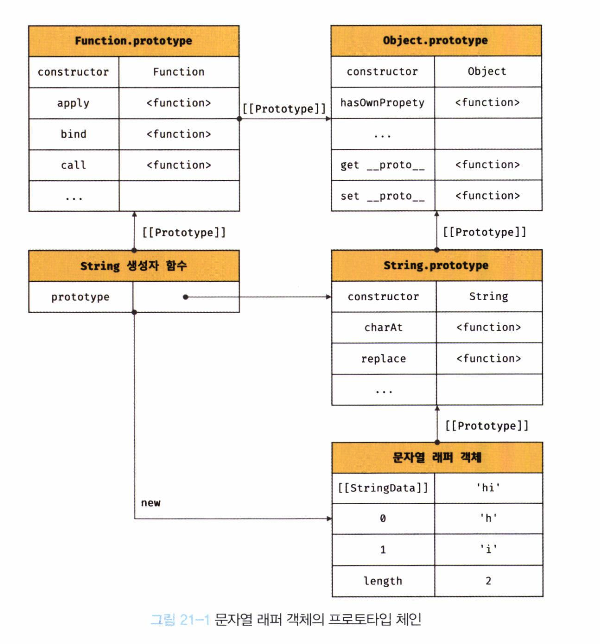
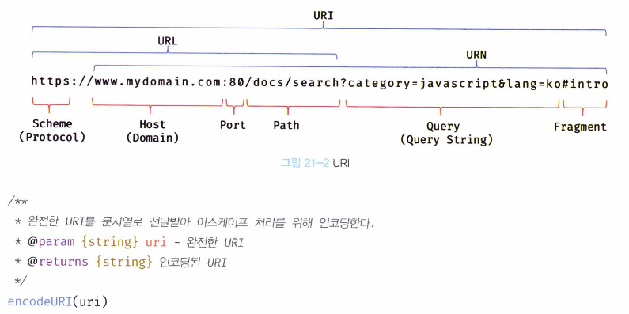

## 자바스크립트의 객체

- **표준 빌트인 객체**  
  ECMAScript 사양에 정의된 객체를 말하며, 애플리케이션 전역의 공통 기능을 제공한다. 전역객체의 프로퍼티로서 제공되고, 별도의 선언 없이 전역 변수처럼 언제나 참조할 수 있다.

- **호스트 객체**  
  ECMAScript 사양에 정의되어 있지 않지만 자바스크립트 실행 환경(브라우저 또는 Node.js)에서 추가로 제공하는 객체를 말한다.
  브라우저 환경에서는 DOM, BOM, Canvas, XMLHttpRequest, fetch, requestAnimationFrame, SVG 와 같은 클라이언트 사이드 Web API를 호스트 객체로 제공하고, Node.js 환경에서는 Node.js 고유 의 API를 호스트 객체로 제공한다.

- **사용자 정의 객체**  
  기본 제공되는 객체가 아닌 사용자가 직접 정의한 객체를 말한다.

## 표준 빌트인 객체

자바스크립트는 0bject, String, Number, BooLean, Symbol, Date, Math, RegEXp, Array, Map/Set, Weaknap/ weakset, Function, Promise, Reflect, Proxy, JSON, Error 등 40여 개의 표준 빌트인 객체를 제공한다.

Math, Reflect, JSON을 제외한 표준 빌트인 객체는 모두 인스턴스를 생성할 수 있는 생성자 함수 객체다. 생성자 함수 객체인 표준 빌트인 객체는 프로토타입 메서드와 정적 메서드를 제공하고 생성자 함수 객체가 아닌 표준 빌트인 객체는 정적 메서드만 제공한다.

```jsx
// String 생성자 함수에 의한 String 객체 생성
const strObj = new String("Lee"); // String {"Lee"}
console.log(typeof strobj); // object
```

생성자 함수인 표준 빌트인 객체가 생성한 인스턴스의 프로토타입은 표준 빌트인 객체의 prototype 프로퍼티에 바인딩된 객체다.

예를들어, 표준 빌트인 객체인 String을 생성자 함수로서 호출하여 생성한 String 인스턴스의 프 로토타입은 `String.prototype` 이다.

```jsx
// String 생성자 함수에 의한 String 객체 생성
const strobj = new String("Lee"); // String {"Lee"}

// string 생성자 수를 통해 생성한 strObj 객체의 프로토타입은 String.prototype이다.
console.log(Object.getPrototypeOf(strObj) === String.prototype); // true
```

## **프로토타입 메서드와 정적 메서드의 차이**

- **프로토타입 메서드**는 인스턴스에서 호출되는 메서드로, 인스턴스와 관련된 동작을 처리.
  ```jsx
  const numObj = new Number(1.5); // Number 인스턴스 생성
  console.log(numObj.toFixed(2)); // "1.50" (소수점 2자리까지 문자열 반환)
  ```
- **정적 메서드**는 클래스(혹은 객체)에서 직접 호출되어, 인스턴스와 상관없이 동작.
  ```jsx
  console.log(Number.isInteger(0.5)); // false (정수인지 검사)
  console.log(Number.isInteger(2)); // true (정수 확인)
  ```

## 원시값과 래퍼객체

문자열이나 숫자, 불리언 등의 원시값이 있는데도 String, Number 같은 표준 빌트인 생성자 함수가 존재하는 이유가 무엇일까?

```jsx
const str = "hello";

// 원시 타입인 문자열이 프로퍼티와 메서드를 갖고 있는 객체처럼 동작한다.
console.log(str.length); // 5
console.log(str.toUpperCase()); // HELLO
```

원시값에 대해 마치 객체처럼 마침표 표기법(또는 대괄호 표기법)처럼 접근하면 자바스크립트 엔진이 객체로 변환해준다. 이렇게 생성되는 임시객체를 **래퍼 객체(Wrapper Object)**라고 한다



그 후 래퍼 객체의 처리가 종료되면 래퍼객체의 [[StringData]] 내부슬롯에 할당된 원시값으로 원래의 상태(원시값)을 갖도록 되돌리고, 래처 객체는 가바지컬렉션의 대상이 된다.

```jsx
//① 식별자 Str은 문자열을 값으로 가지고 있다.
const str = "hello";

// ② 식별자 str은 암묵적으로 생성된 래퍼 객체를 가리킨다.
// 식별자 str의 값 'helLo는 래퍼 객체의 [[StringData]] 내부 슬롯에 할당된다.
// 래퍼 객체에 name 프로퍼티가 동적 추가된다.
str.name = "Lee";

//③ 식별자 str은 다시 원래의 문자열, 즉 래퍼 객체의 [[StringData]] 내부 슬롯에 할당된 원시값을 갖는다.
// 이때 에서 생성된 래퍼 객체는 아무도 참조하지 않는 상태이므로 가비지 컬렉션의 대상이 된다.

//④ 식별자 str은 새롭게 암묵적으로 생성된(②에서 생성된 래퍼 객체와는 다른) 래퍼 객체를 가리킨다.
// 새롭게 생성된 래퍼 객체에는 name 프로퍼티가 존재하지 않는다.
console.log(str.name); // undefined

//⑤ 식별자 str은 다시 원래의 문자열, 즉 래퍼 객체의 [[StringData]] 내부 슬롯에 할당된 원시값을 갖는다.
// 이때 ④에서 생성된 래퍼 객체는 아무도 참조하지 않는 상태이므로 가비지 컬렉션의 대상이 된다.
console.log(typeof str, str); // string hello
```

문자열, 숫자, 불리언, 심벌 이외의 원시값, 즉 null과 undefined는 래퍼 객체를 생성하지 않는다. 따라서 null과 undefined 값을 객체처럼 사용하면 에러가 발생한다.

# 전역 객체란

- 전역객체는 코드가 실행되기 이전 단계에 자바스크립트 엔진에 의해 어떤 객체보다도 먼저 생성되는 특수한 객체이며, 어떤 객체에도 속하지 않은 최상위 객체다.
- 브라우저 환경에서는 window(또는 self, this, frames)가 전역 객체를 가리키지만 Node.js 환경에서는 global이 전역 객체를 가리킨다. 두 환경에서 전역객체를 가리키던 식별자를 통일한 globalThis 도 있다.

## 전역 객체의 특징

- 전역 객체는 개발자가 의도적으로 생성할 수 없다. 즉, 전역 객체를 생성할 수 있는 생성자 함수가 제공되지 않는다.
- 전역 객체의 프로퍼티를 참조할 때 window(또는 global)를 생략할 수 있다.
- 전역 객체는 0bject, String, Number, Boolean, Function, Array, RegExp, Date, Math, Promise 같은 모든 표준 빌트인 객체를 프로퍼티로 가지고 있다.
- 자바스크립트 실행 환경(브라우저 환경 또는 Node js 환경)에 따라 추가적으로 프로퍼티와 메서드를 갖는다. 브라우저 환경에서는 DOM, BOM, Canvas, XMLHttpRequest, fetch, requestAnimationFrame, SVG, Web Storage, Web Component, Web Worker 같은 클라이언트 사이드 Web AP를 호스트 객체로 제공하고 Node js 환경에서는 Node js 고유의 API를 호스트 객체로 제공한다.
- var 키워드로 선언한 전역 변수와 선언하지 않은 변수에 값을 할당한 암묵적 전역, 그리고 전역 함수는 전역 객체의 프로퍼티가 된다.

  ```jsx
  // var 키워드로 선언한 전역 변수
  var foo = 1;
  console.log(window.foo); // 1

  // 선언하지 않은 변수에 값을 암묵적 전역. bar는 전역 변수가 아니라 전역 객체의 프로퍼티다.
  bar = 2; // window.bar = 2
  console.log(window.bar); // 2

  // 전역 함수
  function baz() {
    return 3;
  }
  console.log(window.baz()); // 3
  ```

- let이나 const 키워드로 선언한 전역 변수는 전역 객체의 프로퍼티가 아니다. 즉, window. foo와 같이 접근할 수 없다. Let이나 const 키워드로 선언한 전역 변수는 보이지 않는 개념적인 블록(전역 렉시컬 환경의 선언적 환경 레코드) 내에 존재하게 된다.
  ```jsx
  let foo = 123;
  console.log(window.foo); // undefined
  ```

## 빌트인 전역 프로퍼티

- Infinity
- NaN
- undefind

## 빌트인 전역 함수

- eval(쓰지말자)
- isFinite
- isNaN
- parseFloat
- parseInt
- encodeURI / decodeURI
  - encodeURI 함수는 완전한 URI를 문자열로 전달받아 이스케이프 처리를 위해 인코딩한다.
    
